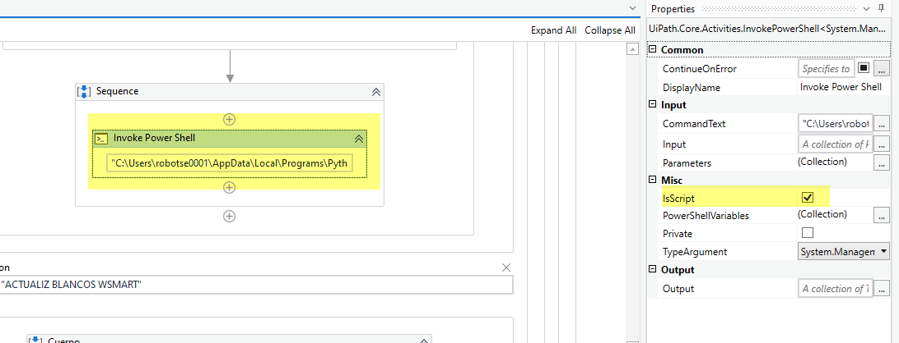
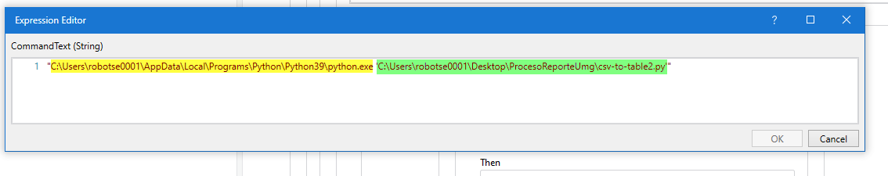

# Ejecutar script python con uipath

> Autor: Rafael Angel Mamani Diaz 
>
> version: 1.0

Podemos crear algunos scripst en python los cuales nos pueden ayudar a realizar tareas de forma mas eficiente, por ello es necesario integrar el python con el uipath

## Requisitos para la integración

- Tener instalado el python en  la maquina
- Tener instalado los paquetes de python que usen los scripts

## Llamando un archivo python en uipath

como se puede observar se necesita la actividad invoke power shell, y se tiene que activar la opcion **IsScript**

## Rutas para la ejecucion

como se puede ver en la imagen necesitamos dos rutas, la primera indica donde esta el python exe, y la segunda con la ubicacion del archivo python, con esto finalizamos la configuración.